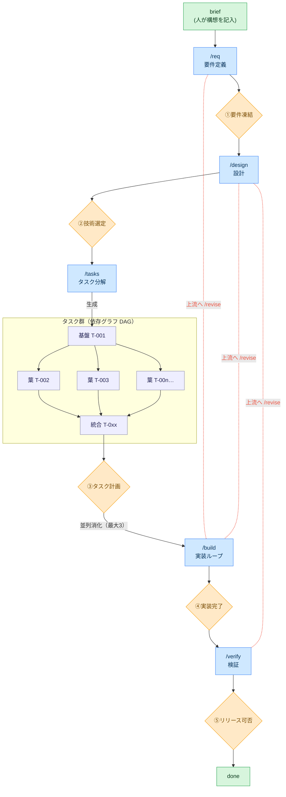

# AgentLoop

[English](README.md) | **日本語**

**Human on the Loop** で開発を進めるためのコーディングエージェント・ハーネス。エージェントが
要件定義〜テストまでの作業・成果物作成・自己テストを担い、**人間は各フェーズ境界の「ゲート」で
承認・判断するだけ**でよい。

ハーネスは**インストール型 CLI**（`agentloop`）で、プロダクトのリポジトリは*状態*だけを持つ —
`.agentloop/`（SSOT + lock + 実体化した prompts/schema）と `docs/`（成果物）。
**Claude Code** と **VS Code GitHub Copilot** はフル対応（フックによるゲート強制まで）、
**Codex** など `AGENTS.md` を読むエージェントは規約＋手順レベルで対応（ゲートは慣習による）。
詳細は「エージェント対応」。

## コンセプト



🟦 エージェントが実施するフェーズ ／ 🟧 **人だけ**が開くゲート①〜⑤ ／ 🟩 人の関与点 ／
🟪 タスク（DAG。基盤→並列葉→統合）。**上から下へ前進**し（前提ゲート未承認なら次へ進めない）、
`/build` がタスク群を並列消化（最大3）。赤い点線＝`/revise` による上流への差し戻し（戻し先以降の
ゲートを連鎖して `pending` に戻す）— これも人の判断で行う。

## どこから始めるか

まず CLI を一度インストールする（`uv tool install git+<the agentloop repo>` で `agentloop` が PATH に入る）。その上で:

| あなたの状態 | 入口 |
|---|---|
| ゼロから新プロダクトを作る（greenfield） | 「セットアップ」→「使い方」 |
| 進行中の既存リポジトリ（brownfield） | 「セットアップ」— `agentloop init` が自動判定 — の後 `/onboard` |
| 導入済みで、次の変更を始める | `docs/00-product-brief.md` に変更を書いて `/req`（前サイクル未クローズなら先に `agentloop cycle-close --name <slug>`） |
| リリース判断（ゲート⑤）が出た | `agentloop cycle-close --name <slug>` — このサイクルの docs を退避し次サイクル用にリセット |
| 実体化したツール群を更新したい | `agentloop upgrade`（撤去は `agentloop uninstall --all`） |
| 現在地が分からない・中断から再開 | `/status`（次に打つコマンドまで表示）、または `agentloop ui`（ローカルダッシュボード） |

日常の人間向けコマンドは少数の動詞に集約されている（それ以外はダッシュボードのボタンの役割 —
一覧は `agentloop --help`）:

```bash
agentloop start        # 初回: 対話ウィザードで導入 / 導入済みなら現在地と次の一手
agentloop next         # 次に打つべきコマンドだけを表示（連携用に --json あり）
agentloop ui           # ローカルダッシュボード — ゲート承認・doctor・revise・cycle-close をページから実行
agentloop agent codex  # ヘッドレスのエージェント CLI を切替（claude | codex | gemini | 任意コマンド）
```

## 設計原則

AgentLoop は**それ自体が複数エージェントのオーケストレーション**であり、3つの設計軸に沿う。

- **Architecture** — 動く最もシンプルな構成: `agentloop build` は**決定論的な DAG** スケジューラ、
  各フェーズは専用ロールエージェントへ委譲し関心を分離。
- **Context** — 必要最小限に保つ: SSOT が真実を保持、ロールエージェントは必要分のみ読む、失敗は
  **ダンプせず要約**、ログは自動ローテーション、記憶はセッション/サイクル/恒久の3層。
  `AGENTS.md`「Context budget」参照。
- **Tools** — ロールエージェントの tool 付与は最小・用途限定、品質ゲートに再試行上限。

## セットアップ

前提: WSL / Linux / macOS。フックが PATH で解決できるよう CLI をインストールする:

```bash
uv tool install git+https://github.com/you/AgentLoopTemplate   # `agentloop` を提供
```

モード A（`agentloop build`）は加えて**ヘッドレスのエージェント CLI** が必要 — 既定は `claude -p`、
`agentloop agent codex` で切替できる（`.agentloop/config.yaml` の `build.headless.cmd` を書き換える。
`gemini` や任意コマンドも可）。無ければ対話のモード B を使う（「エージェント対応」参照）。

リポジトリを初期化する — **greenfield** でも **brownfield** でも同じコマンド（brownfield は自動判定:
既存のコード構成があれば `gates.guard_paths` を docs 成果物のみに限定してゲート未承認でも既存コードの
開発を止めず、test/check コマンドはあなたのツールから検出する）:

```bash
cd myrepo && git init            # 新規でも既存でも同じ

# 対話ウィザード（推奨。名前 / ブランチ / 取得元 / ヘッドレスCLI / brief の1行を質問）
agentloop start
# 非対話でやるなら（冪等）:
#   agentloop init --name <product> [--branch build/<product>] [--source git+https://github.com/you/AgentLoopTemplate]

# 任意・開発環境ごと — 必要になったらエージェントの面を追加:
agentloop install claude         # .claude/ ラッパーを書き settings.json をマージ
agentloop install copilot        # .github/ の prompt/agent/hook ラッパーを書く
```

`agentloop init` が書くのは**状態だけ**: SSOT 三点（`state.md` / `config.yaml` / `tasks.yaml`。
プレースホルダ埋め）、docs スキャフォールド、実体化した `.agentloop/prompts` + `.agentloop/schema`
+ `.agentloop/AGENTS.agentloop.md`、まっさらなスキャフォールドのスナップショット、そして
`.agentloop/agentloop.lock`（ツールのバージョン/取得元 + 導入ファイルごとの内容ハッシュ）。`AGENTS.md`
にはマーカー付きのポインタブロックを追記し、作業ブランチを作成・切替（実装は main 直ではなくそこ）、
ゲートガードを本稼働させる。それ以外は触らない: ビルドファイルも makefile も、`agentloop install` しない
限りエージェントの面も入らない。brownfield では `/onboard` への案内も付く。

`agentloop sync` はインストール済みパッケージから prompts/schema を再実体化する（まっさらなファイルは
更新、ローカル改変は保持して列挙、`--force` で上書き、`--check` は書き込まずドリフトを報告）。
`agentloop upgrade` は CHANGELOG の差分を表示し、ツールが実体化した全てを更新する。*コード*の更新は
`uv tool upgrade agentloop`。

## 既存リポジトリへの導入（brownfield）

別の adopt コマンドは無い — `agentloop init` が唯一の入口で、既存コードベース（`src/`・`package.json`・
`pyproject.toml` …）を**自動判定**する。そのモードでは:

- `config.yaml` の `guard_paths` を docs 成果物のみに限定し、ゲート未承認でも既存コードの開発を止めない
  （準備できたら `src/: tasks` 等のコードパスを再有効化）;
- 認識できれば品質ゲートの test/check コマンドをあなたのツールから埋める（`--test-cmd` / `--check-cmd`
  で上書き可）;
- `docs/00-product-brief.md` に `/onboard` を指す導入ノートを付す。

既存ファイルは**絶対に上書きしない**（再実行は冪等）。導入したリポジトリでの流れ:

1. **`/onboard`** — 既存コードベースを読み取り専用で調査し、**永続ベースライン**
   `docs/05-current-state.md` を生成する。既存の動作を要件や done タスクへ**逆生成はしない** —
   ゲートを開くのは常に人間で、トレーサビリティ（R-N）は各サイクルのデルタにだけ適用される。
   実装が半分できている場合は、先頭の**吸収タスク**が既存の部分実装をテストで green に固定してから
   新しい作業を積む。
2. **デルタサイクル** — `brief → /req → … → /verify` の1周は**1つの変更**を扱う（回し方は「使い方」と
   同じ）。リリース判断のあと `agentloop cycle-close --name <slug>` がサイクルの docs を退避し、
   ゲート/フェーズをリセットする。`docs/00-product-brief.md` と `docs/05-current-state.md` は残る。
3. **いつでも撤去** — `agentloop uninstall claude|copilot` はエージェントの面を撤去し（まっさらな
   ファイルのみ。settings のマージはエントリ単位で戻す）、`agentloop uninstall --all` は実体化した
   成果物と lock を全て削除する。リポジトリの状態（SSOT・`docs/`）には触れない。

## 使い方

1. `docs/00-product-brief.md` に「何を作りたいか」を数行書く（人が書く唯一の出発点）。
2. 以下を順に実行する。各コマンドは最後に承認を求めて止まる。

   | 手順 | コマンド | 何が起きるか | あなた（人）の役割 |
   |------|----------|--------------|--------------------|
   | 要件 | `/req`    | 壁打ちで要件を構造化 | ① 要件を凍結 |
   | 設計 | `/design` | 実装方針＋技術選定の選択肢提示 | ② 技術選定を決定・承認 |
   | 分解 | `/tasks`  | テスト方針付きタスク票を生成 | ③ タスク計画を承認 |
   | 実装 | `/build`  | loop で自律実装（test green 条件） | ④ 実装完了をレビュー承認 |
   | 検証 | `/verify` | 機能＋非機能テストを実行 | ⑤ リリース可否を判断 |

3. **ゲートを開く**: 承認は操作として記録する — `agentloop approve <gate> [--by <name>]` がゲート行に
   日付・承認者を刻印し、フェーズを進め、`gate_approved` イベントを記録する。エージェントはあなたの
   明示的な「承認」の後にこれを実行してよいが、事前許可（pre-authorize）は決してしない（権限プロンプト
   こそがあなたの確認）。ゲート行の手編集はガードが拒否する。
4. **差し戻し**: 上流（要件/設計）の不備が判明したら `/revise <phase>` で戻し先以降のゲートを連鎖して
   `pending` に戻し、影響タスクをマークする（`agentloop revise --impacted T-00x` が種タスクとその
   推移的下流を `needs-revision` に設定）。承認の巻き戻しも人の判断で行う。
5. **進捗確認**: `agentloop next` が次に打つべきコマンドだけを表示（連携用に `--json`）、`/status` は
   チャットで全体像、`agentloop ui` は同じ内容をブラウザで見られる（既定で読み取り専用。安全な操作の
   固定ホワイトリストとゲート承認の記録もページから実行できる）。タスクの依存図は
   `agentloop dag --mermaid` で生成できる。
6. **PR として出す**: `agentloop pr-draft` が SSOT から PR 本文を `.agentloop/pr-draft.md` に組み立てる
   （読み取り専用）。PR の作成/push は従来どおり人間の操作。
7. **サイクルを閉じる**: ゲート⑤のあと `agentloop cycle-close --name <slug>` が docs を
   `docs/archive/<日付>-<slug>/` へ退避し、新しいスキャフォールドを復元、ゲート/フェーズをリセット
   する。ゲートを開くのと同じく人間の操作。

> **承認待ち中も止まらない**: ゲート到達時に通知が飛び、承認を待つ間もエージェントは**承認結果に
> 依存しない**作業（環境構築・調査・テストハーネス整備など）だけを先回りで進める。承認結果を先取り
> する作業はしないためゲートの厳密さは保たれ、先回り分は暫定・破棄前提で `state.md` の「先回り作業
> ログ」に記録される。

### 実装フェーズを自律で回す

挙動（DoD・並列/マージ規則）が同一の2モードがある。正典は `.agentloop/prompts/commands/build.md` ＋ `AGENTS.md`。

**A. 確定実行（推奨）— `agentloop build`。** オーケストレータが**どのタスクを・何並列で・どの順に
マージし・いつ止めるか**を `config.yaml` ＋ `tasks.yaml` から確定的に決め、LLM 裁量に依存しない
（`--dry-run` でエージェント CLI/git を呼ばず制御フローだけ確認）。

**B. 対話ループ** — リードが会話でモード A を再演する（ヘッドレス CLI が無い環境で使える唯一の
モード）。Claude Code は `/loop /build`、Copilot は `/build` を反復起動、Codex は `/build` の手順を再実行。

両モード共通:

- 各タスクは**品質ゲートのパイプラインを全て通って**初めて完了 — `config.yaml` の `quality_gate.steps`
  が **DoD の唯一の定義**（既定: `test` → `check` → `/code-review`+`/simplify` の review ステップ →
  起動可能な成果物では実起動スモーク）。各ステップは自分のリトライ予算を持ち、尽きたら `blocked`。
  成果物が起動可能になったら smoke ステップに `required: true` を設定する（空だと起動チェックを黙って
  スキップせずビルドを拒否する）。
- **並列の葉は隔離実行**: `git worktree` で分離して最大3並列（`max_parallel`）、完了後に id 昇順で
  作業ブランチへマージ。バッチで**2つ以上**の葉をマージした後は、マージ済みブランチで cmd ステップを
  再実行する（統合ゲート）。どのマージ前にも、タスクが変更した全パスをゲート規則に照らして再検査
  する — 違反はエスカレーション（`gate_violation`）して blocked にし、着地させない。
- 解決不能なタスクは `blocked`、上流の不備は `needs-revision` としてエスカレーションしループが止まる。
  **`gates.build` はオーケストレータも触らない**（ゲートは人だけが開ける）。

> **DoD のコマンドはプロジェクト固有**: `quality_gate.steps` で一度だけ名前を付ける（同梱の既定
> `make test` / `make check` はプレースホルダ — brownfield では `agentloop init` が検出コマンドを埋め、
> それ以外は各自のコマンドに読み替える）。

### セキュリティ検査

3層で担保する: **gitleaks**（pre-commit でシークレットのコミットを防止。誤検知は `.gitleaksignore`）／
実装完了時に**セキュリティレビュー**必須 — モード A では全タスク done 時に自動でヘッドレス実行し、
レビュー対象 HEAD を埋め込んだレポートを `.agentloop/security-review.md` に束ねる／`/verify` で
**セキュリティレビュー + 依存の脆弱性監査**必須。`/security-review` を持たないエージェントは同等の
パスを行い同じ形で記録する。

### GitHub Issues 連携（任意）

**既定オフ**。`github.enabled: true` で有効化（`gh` CLI ＋ GitHub remote が前提。無ければ自動スキップ）。
`agentloop issue-sync` が `tasks.yaml` を Issues へ**一方向ミラー**する — 各タスク T-NNN ↔ Issue 1件、
不可視マーカー `<!-- agentloop:T-NNN -->` で突き合わせ、`kind:*` / `status:*` / `phase:*` / `req:*`
ラベル（自動作成）を付与。Issues 側の編集は読み戻さない（`tasks.yaml` が常に SSOT）。Issue 書き込みは
外向き操作のため opt-in が同意を兼ねる。

## トラブルシューティング

- **まず `agentloop doctor`** — 環境と SSOT の読み取り専用一括診断（PATH バイナリ、config/state/tasks の
  整合性、ゲート連鎖の不変条件、フック登録、worktree の残骸、未解決エスカレーション、セキュリティ
  レビューと HEAD の束縛、lock の健全性、schema 検証）。以下の多くはここに FAIL/WARN として現れる。
- **タスクが `blocked` になった** — リトライ予算内で品質ゲートを通せなかった。`agentloop events
  --render` でエスカレーションを読み、原因（またはタスク票）を直し、`tasks.yaml` の `status` を `todo`
  に戻し、`agentloop events --resolve <ID> --note "…"` でイベントを閉じてから `agentloop build` を
  再実行する。上流の不備なら代わりに `/revise <phase>`。
- **ループが中断した**（Ctrl-C・クラッシュ）— そのまま `agentloop build` を再実行すればよい。起動時に
  `in_progress` のタスクを `todo` に戻し、残った worktree も掃除する。
- **ゲートガードに編集を拒否された** — 前提ゲートが `pending` のまま次フェーズの成果物を編集しようと
  している（機構が正しく働いている状態）。まずゲートの承認を得る。緊急脱出口は `gates.enforce_hook:
  false`。
- **「template placeholders」で起動を拒否する** — 先に `agentloop start`（または
  `agentloop init --name <product>`）を実行する。
- **フックで `agentloop: command not found`** — CLI を PATH に入れる（`uv tool install git+<the agentloop
  repo>`）。フックのバイナリが解決できないと `agentloop doctor` が FAIL する。

## 構成

| パス | 役割 |
|------|------|
| `.agentloop/state.md` | フェーズ・ゲート・ログの SSOT |
| `.agentloop/tasks.yaml` | タスクグラフ(DAG)の機械可読 SSOT |
| `.agentloop/events.ndjson` | オーケストレーション・イベント — エスカレーションログの機械可読の真実（`agentloop events`。最初のイベント時に生成） |
| `.agentloop/config.yaml` | 確定実行のノブ源と DoD の唯一の定義（`quality_gate.steps`） |
| `.agentloop/agentloop.lock` | ツールのバージョン/取得元・schema バージョン・導入ファイルごとの内容ハッシュ |
| `.agentloop/schema/` | `config.yaml`／`tasks.yaml` の JSON Schema（エディタ検証・`agentloop doctor`）— 実体化 |
| `.agentloop/prompts/` | 全エージェントが読む共有のフェーズ手順・ロール定義 — 実体化 |
| `.agentloop/AGENTS.agentloop.md` | エージェントの面が import する運用規約の本体 — 実体化 |
| `AGENTS.md` / `CLAUDE.md` | エージェント中立な運用規約の正本 / Claude Code の能力対応表 |
| `.claude/`・`.github/` | 各工程のエージェント別入口・ロールラッパー・ゲートガードのフック登録（`agentloop install` で任意導入） |
| `docs/` | 工程成果物（要件・設計・ADR・タスク票・テスト計画） |

オーケストレーションのコード自体はインストール済みの `agentloop` パッケージにあり、リポジトリには置かれない。

## エージェント対応

規約（`AGENTS.md`）と手順（`.agentloop/prompts/`）はエージェント中立で、人との対話ポイントを
**能力ボキャブラリ**で記述する。各エージェントの対応表ファイルがその実現方法を定める。

| 能力 | Claude Code | VS Code Copilot | Codex（他の AGENTS.md 読者含む） |
|---|---|---|---|
| フェーズ入口 | スラッシュコマンド（`.claude/commands/`） | prompt files（`.github/prompts/`） | フェーズ名を指示 → `.agentloop/prompts/commands/<name>.md` を読む |
| ゲート強制 | PreToolUse フック + commit 段チェック | 同じフックを agent hooks（preview）+ commit 段チェック | commit 段チェックのみ。編集時は慣習 |
| 人への構造化質問 | AskUserQuestion | チャットで番号付き選択肢 | チャットで番号付き選択肢 |
| 承認の提示 | plan mode + ExitPlanMode | Plan モード / 明示の「approve」 | 明示の「approve」 |
| ロール委譲 | subagents、worktree 並列 | custom agents `@architect` … | inline でロールを引き受け（直列） |
| 自律ビルド | `/loop /build`（B）・`agentloop build`（A） | `/build` を反復（B）・`agentloop build`（A） | `/build` を再実行（B）・`agentloop build`（A） |
| ゲート待ち通知 | PushNotification | ターン終了時に明示 | ターン終了時に明示 |

エージェントの面はオプトイン — `agentloop install claude|copilot` が書き込み、インストール済みの
`agentloop` CLI を呼ぶ（フックの前提として `uv tool install` が要る）。VS Code Copilot の agent hooks は
**preview** 機能 — 無効ならゲートは慣習レイヤーで維持される。並列の葉タスクは委譲が使えない場合は
直列に劣化する。どのフックホストが登録済みかは `agentloop doctor` が報告する。
