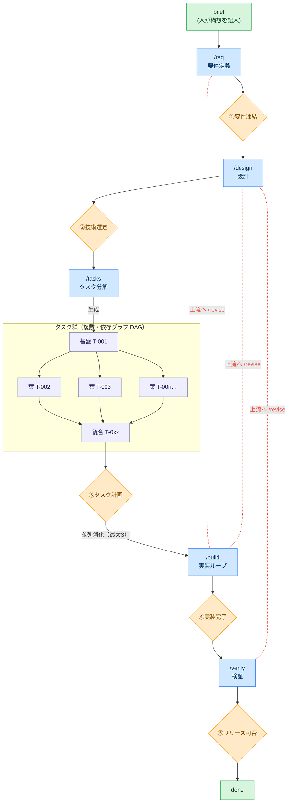

# AgentLoopTemplate

[English](README.md) | **日本語**

**Human on the Loop** で開発を進めるためのコーディングエージェント・テンプレート。
**Claude Code** と **VS Code GitHub Copilot** はフル対応（フックによるゲート強制まで）、
**Codex** など `AGENTS.md` を読むエージェントは規約＋手順レベルで対応（ゲートは慣習による）—
詳細は後述の「エージェント対応」。
コーディングエージェントが要件定義〜テストまでの作業・成果物作成・自己テストを担い、
**人間は各フェーズ境界の「ゲート」で承認・判断するだけ**でよい。

## コンセプト



凡例: 🟦 青=エージェントが実施するフェーズ ／ 🟧 橙=人が承認するゲート①〜⑤ ／ 🟩 緑=人の関与点（構想の記入・完了判断）／ 🟪 薄紫=タスク（**複数**・依存グラフ DAG。基盤→並列葉→統合）。**上から下へ前進**し（前提ゲート未承認なら次へ進めない）、`/tasks` がタスク群を生成→ゲート③承認→`/build` が並列消化（最大3）。赤い点線＝`/revise` による上流への差し戻し（build/verify から design/req へ。戻し先以降のゲートを連鎖して `pending` に戻す）。

各ゲートは人だけが開ける。承認の巻き戻し（`/revise`）も人の判断で行う。

## どこから始めるか

| あなたの状態 | 入口 |
|---|---|
| ゼロから新プロダクトを作る | 「セットアップ（新規リポジトリ / greenfield）」→「使い方」 |
| 進行中の既存リポジトリに導入する | 「既存リポジトリへの導入（brownfield）」→ `/onboard`（開始状態別の対応表の全体は `/onboard` 内） |
| 導入・初期化済みで、次の変更を始める | `docs/00-product-brief.md` に変更を書いて `/req`（前サイクルが未クローズなら先に `make cycle-close NAME=<slug>`） |
| リリース判断（ゲート⑤）が出た | `make cycle-close NAME=<slug>` — このサイクルの docs を退避し、次サイクル用にリセット |
| テンプレートのツール群を更新/撤去したい | `make -f agentloop.mk agentloop-upgrade` / `agentloop-uninstall` |
| 現在地が分からない・中断から再開する | `/status` — 次に打つコマンドまで表示される |

## 設計原則

本テンプレートは **それ自体が複数エージェントのオーケストレーション**であり、その仕組みは3つの設計軸に沿う。

- **Architecture** — 要件を満たす最もシンプルな構成: `build_loop.py` は**決定論的な DAG**（制御/デバッグ容易）、各フェーズは専用ロールエージェントへ委譲し関心を分離。
- **Context** — 必要最小限に保つ: SSOT（`state.md` / `tasks.yaml`）が真実を保持、ロールエージェントは必要分のみ読む、失敗は**ダンプせず要約**、肥大ログは自動ローテーション、セッション自体もフェーズ境界のチェックポイントで圧縮 — 記憶はセッション/サイクル/恒久の3層で、各層が固有の更新サイクルを持つ（`AGENTS.md`「Context budget」参照）。
- **Tools** — ロールエージェントの tool 付与は最小・用途限定、品質ゲートに**再試行上限**（`config.yaml`）、`summarize_failure()` が簡潔で要点のある失敗を返す。

## セットアップ（新規リポジトリ / greenfield）

前提: WSL / Linux / macOS と `make`（Windows ネイティブ不可）。確定ビルドループ（`make build-loop`、モード A）は加えて `claude` CLI の導入と認証が必要（implementer と review ステップが headless `claude -p` を回すため）。起動はどのエージェントからでも（人間のターミナルからでも）よく、CLI が無ければ対話のモード B を使う。「エージェント対応」参照。

1. **このテンプレートをコピー**して新しいプロダクトのリポジトリにする:
   ```bash
   git clone --depth 1 https://github.com/you/AgentLoopTemplate.git myproduct
   cd myproduct && rm -rf .git && git init
   # 代替: GitHub の "Use this template" ボタンでリポジトリを作って clone する
   ```
2. ツール導入と依存同期:
   ```bash
   make install   # uv / pnpm のバイナリを導入（公式の curl|sh インストーラを実行。
                  # ロックダウン/オフライン環境では uv・pnpm を手動で導入する）
   make setup     # uv sync（dev 依存を同期、uv.lock を生成）
   # フロントを使う場合: まず frontend/ にアプリの雛形を作り（例: `pnpm create vite frontend`）、
   # `cd frontend && pnpm install`。pnpm が要るのはその場合のみ。
   ```
3. **プロダクトとして初期化**（冪等）:
   ```bash
   make init NAME=<product> FROM=https://github.com/you/AgentLoopTemplate.git
   # 必要なら BRANCH=build/<product>
   ```
   プレースホルダ（`pyproject.toml` の `name`、`.agentloop/state.md` の `project`/`branch`/`updated_at`）を埋め、作業ブランチを作成・切替し、`gates.template_mode` をオフにしてゲートガードを本稼働させる。実装は main 直ではなく作業ブランチで行う。
   あわせて `.agentloop/adopt-manifest.yaml`（出所＋ファイルごとのハッシュ）を記録する — これがコピー導入でも `agentloop-upgrade` / `agentloop-uninstall` を使えるようにする仕組み。`FROM` はテンプレートの git URL（またはローカル checkout パス）で、以後のアップグレードの既定の取得元として記憶される（省略するとアップグレードのたびに `FROM=` の指定が必要）。ルートの `AGENTS.md`・`CLAUDE.md` と `.claude/settings.json` は初日からあなたの所有物で、アップグレードが書き換えることはない（テンプレートの規約更新が greenfield に届くのはその他のツールファイル経由のみ）。
4. 動作確認: `make check`（lint/format/type）・`make test`（pytest。空のテンプレートでも成功する）・`make test-tools`（`scripts/agentloop/` の確定オーケストレータ自己テスト）。

## 既存リポジトリへの導入（brownfield）

進行中のリポジトリにはコピーで上書きするのではなく、このテンプレートの checkout から AgentLoop を**追加インストール**する（衝突検知つき・追記のみ）:

```bash
# テンプレートの checkout から実行。導入先に必要なのは uv バイナリだけ
make adopt TARGET=../myrepo NAME=myrepo TEST_CMD="npm test" CHECK_CMD="npm run lint"
# まず計画だけ確認: make adopt TARGET=../myrepo NAME=myrepo ARGS=--dry-run
```

何がどう入るか（冪等。再実行時は既存分をすべてスキップ）:

| 種別 | 対象 | 挙動 |
|------|------|------|
| copy | `.agentloop/`（共有手順の `prompts/` を含む）、`scripts/agentloop/`、`agentloop.mk`、`.claude/commands|agents`、`.github/prompts|agents|hooks|instructions`、docs スキャフォールド | **既存ファイルは絶対に上書きしない**（スキップして報告） |
| merge | `AGENTS.md` / `CLAUDE.md` | テンプレの規約は `.agentloop/AGENTS.agentloop.md` に置かれ、既存 AGENTS.md にはポインタブロックを、既存 CLAUDE.md には Claude 対応表つきの `@`-import ブロックを、それぞれ1回だけ追記 |
| merge | `.claude/settings.json` | 不足している permissions / フックだけ追記。既存分は触らない |
| adapt | `.agentloop/config.yaml` | **`guard_paths` を docs 成果物のみに限定** — ゲート未承認でも既存コードの開発は止まらない。準備ができたらコードパス（例 `src/: tasks`）を追加。品質ゲートのコマンドは `TEST_CMD`/`CHECK_CMD` から設定 |
| manual | あなたの `makefile`、`.pre-commit-config.yaml` | 触らない — `include agentloop.mk` を1行追加（または `make -f agentloop.mk build-loop`）。gitleaks フック追加を推奨 |

導入したリポジトリでの流れ:

1. **`/onboard`** — 既存コードベースを読み取り専用で調査し、**永続ベースライン** `docs/05-current-state.md` を生成する: アーキテクチャ・モジュールの役割・再利用可能な資産・規約・既存ドキュメントへのリンク（移動・変換はせず現在地のまま）・実装状況（仕掛かり作業を含む）。既存の動作を要件や done タスクへ**逆生成はしない** — ゲートを開くのは常に人間で、トレーサビリティ（R-N）は各サイクルのデルタにだけ適用される。どんな初期状態からでも入れる（対応表の全体は `/onboard` 内）:
   - **ドキュメントが一切無い** — 調査はコード駆動なのでそのまま成立する。コードから読み取れない意図（誰のための何か・非目標）だけを `/onboard` が質問で回収し、brief に書き戻す。仕様書の逆生成はしない。
   - **承認済み相当の要件書・設計書が既にある** — `/req`・`/design` をその取り込みとして高速に走らせてゲートを開く。その承認こそが本機構への対応付けになる。
   - **実装が半分できている** — 最初のサイクルは**残作業のデルタ**だけを計画し、先頭の**吸収タスク**が既存の部分実装をテストで green に固定してから新しい作業を積む（`/tasks` のブラウンフィールド注記）。
2. **デルタサイクル** — `brief → /req → … → /verify` の1周は**1つの変更**を扱い、仕掛かりの残作業はデルタ要件として再開する（1周の回し方自体は後述の「使い方」と同じ）。リリース判断のあと、サイクルを閉じる:
   ```bash
   make cycle-close NAME=<slug>   # このサイクルの docs を docs/archive/<日付>-<slug>/ へ退避し、
                                  # 新しいスキャフォールドを復元、ゲート/フェーズを次サイクル用にリセット
   ```
   `docs/00-product-brief.md` と `docs/05-current-state.md` はサイクルをまたいで残る（ベースラインはアーカイブせず更新する）。サイクルを閉じるのはゲートを開くのと同じく人間の操作。
3. **アップグレード / アンインストール（いつでも）** — どちらの導入経路（ここでの `make adopt`、greenfield の `make init`）でも `.agentloop/adopt-manifest.yaml`（テンプレートの出所・コミット・バージョンと、インストールした全ファイルのハッシュ）が記録される。これを駆動源にした2つのコマンドが使える。どちらもハッシュ検査つきで、**導入後にあなたが編集したファイルは絶対に上書き・削除されない**（スキップして列挙。`FORCE=1` で強制）。実行後は `git diff` でレビューしてコミットする:
   ```bash
   # リポジトリの中で実行 — テンプレート所有のツール群（scripts/agentloop/、共有手順の
   # .agentloop/prompts/、.claude/ と .github/ 配下のエージェント別ラッパー、
   # agentloop.mk、取り込まれた規約）を更新する。FROM は git URL か
   # ローカルパス。省略時は init/adopt 時に記録された出所を再利用。REF はブランチ/タグ（SHA 不可）。
   # 「導入時 → 今」のバージョン遷移とその間の CHANGELOG を表示する。
   # ARGS=--dry-run で（バージョン・changelog・ファイル別の計画を）適用せずに全て確認できる
   make -f agentloop.mk agentloop-upgrade FROM=https://github.com/you/AgentLoopTemplate.git

   # 導入の撤去: インストールされたものを pristine な範囲で除去。CLAUDE.md の @import ブロック・
   # AGENTS.md のポインタブロック・settings.json へのマージ分も取り消す
   make -f agentloop.mk agentloop-uninstall ARGS=--dry-run
   ```
   アップグレードはリポジトリ所有の状態（`config.yaml`・`state.md`・`tasks.yaml`・記入済み docs・あなたの AGENTS.md/CLAUDE.md）に絶対に触れない。アンインストールは未編集のものだけ削除する。テンプレートの身元はルートの `VERSION`/`CHANGELOG.md` が担い、どちらも adopt ではコピーされない（マニフェストの `template.version` が記録）。また導入時に `TEST_CMD`/`CHECK_CMD` を省略すると、ビルドファイル（package.json・pyproject.toml・Cargo.toml・go.mod・makefile）から検出したコマンドを**提案として表示**する（自動書き込みはしない）。

## 使い方

1. `docs/00-product-brief.md` に「何を作りたいか」を数行書く（人が書く唯一の出発点）。
2. 以下を順に実行する。各コマンドの最後に人の承認を求めて止まる。

   | 手順 | コマンド | 何が起きるか | あなた（人）の役割 |
   |------|----------|--------------|--------------------|
   | 要件 | `/req`    | 壁打ちで要件を構造化 | ① 要件を凍結 |
   | 設計 | `/design` | 実装方針＋技術選定の選択肢提示 | ② 技術選定を決定・承認 |
   | 分解 | `/tasks`  | テスト方針付きタスク票を生成 | ③ タスク計画を承認 |
   | 実装 | `/build`  | loop で自律実装（test green 条件） | ④ 実装完了をレビュー承認 |
   | 検証 | `/verify` | 機能＋非機能テストを実行 | ⑤ リリース可否を判断 |

3. 実装中に上流（要件/設計）の不備が判明したら **`/revise <phase>`** で差し戻せる（戻し先以降のゲートを連鎖して `pending` に戻し、`dag.py --impacted` で影響タスクを reconcile）。`make revise ARGS="--to <phase> --reason '...'"` の直接実行でもよい。承認の巻き戻しも人の判断で行う。
4. いつでも `/status` で現在フェーズ・ゲート承認状況・タスク進捗を確認できる。タスクの**全体像（依存図）**は `uv run --no-project --with pyyaml python scripts/agentloop/dag.py --mermaid` で Mermaid を生成でき、GitHub/VS Code/Markdown にそのまま描画される（status 色分け・クリティカルパス強調）。
5. サイクルを PR として出すなら `make pr-draft` — SSOT（ゲート承認・タスク表・要件カバレッジ・セキュリティレビューの束縛・コミット一覧）から PR 本文を `.agentloop/pr-draft.md` に組み立てる。読み取り専用で、`gh pr create --body-file` の実行行を表示するだけ — PR の作成/push は従来どおり人間の操作。
6. リリース判断（ゲート⑤）のあとは `make cycle-close NAME=<slug>` でサイクルを閉じる: このサイクルの docs を `docs/archive/<日付>-<slug>/` へ退避し、新しいスキャフォールドを復元、ゲート/フェーズを次サイクル用にリセットする。greenfield / brownfield 共通の操作（`docs/00-product-brief.md` とベースライン `docs/05-current-state.md` は残る）。サイクルを閉じるのはゲートを開くのと同じく人間の操作。

> **承認待ち中も止まらない**: ゲート到達時に通知が飛び、承認を待つ間もエージェントは
> 承認結果に依存しない作業（環境構築・調査・テストハーネス整備など）を先回りで進める。
> 承認結果を先取りする作業はしないため、ゲートの厳密さは保たれる。先回り分は暫定・破棄前提で
> `.agentloop/state.md` の「先回り作業ログ」に記録され、人が採否を判断できる。

### 実装フェーズを自律で回す

実装ループには2つのモードがある。挙動（DoD・並列/マージ規則）は同一。以下は要点で、運用の正典は `.agentloop/prompts/commands/build.md`（手順）と `AGENTS.md`（規約）:

**A. 確定実行（推奨）— `make build-loop`**
スケジューリングをコードで確定駆動するオーケストレータ（`scripts/agentloop/build_loop.py`）。**どのタスクを・何並列で・どの順にマージし・いつ止めるか**を `.agentloop/config.yaml` と `tasks.yaml` から確定的に決め、LLM 裁量に依存しない。

```
make build-loop                  # 実行
make build-loop ARGS=--dry-run   # claude/git を呼ばず制御フローだけ確認
```

**B. 対話ループ — リードが会話でモード A を再演する**
オーケストレータを使わず会話でループを回す代替（`claude` CLI が無い環境で使える唯一のモード）。Claude Code は `/loop /build` で、VS Code Copilot は `/build` プロンプトを反復起動して、Codex は `/build` の手順を再実行して回す。

- 各タスクは **品質ゲートのパイプラインを全て通って**初めて完了扱い — `.agentloop/config.yaml` の `quality_gate.steps` が **DoD の唯一の定義**（既定: `make test` green → `make check` clean → `/code-review`+`/simplify` の規律を適用する review ステップ → 起動可能な成果物では実起動スモーク）。`tasks.yaml` のタスク自身の `test` コマンドが設定済みステップと異なる場合は、焦点を絞ったステップとして先頭で実行される。各 cmd ステップは自分のリトライ予算を持ち、失敗は予算が尽きるまで implementer に差し戻される（尽きたら `blocked`）。成果物が起動可能になったら smoke ステップに `required: true` を設定する — 以後コマンドが空だと起動チェックを黙ってスキップせず、ビルド自体を拒否する。
- **並列タスクは隔離実行**: 独立した葉タスクは `git worktree` で各自のブランチ・作業ディレクトリに分離して **最大3並列**（`config.yaml` の `max_parallel`）で実装し、完了後に id 昇順で作業ブランチへ順次マージする。基盤タスクは作業ブランチ上で先に確定する。バッチで**2つ以上**の葉をマージした後は、**マージ済み**の作業ブランチ上で cmd ステップをもう一度実行する（統合ゲート — 各葉は隔離状態でしか green を確認していない）。赤ならリトライ予算内でヘッドレスの fixer に修正させ、尽きたらバッチを blocked にする。worktree の未コミット変更はマージ/掃除の前に葉ブランチへ確定コミットされるため、worktree と一緒に消えることはない。
- 解決不能なタスクは `blocked`、上流に不備があれば `needs-revision` として **人にエスカレーション**し、ループが止まる。
- **確定化の境界**: 制御フロー・並列・マージ・cmd ステップのゲート判定・停止はコードで確定。各タスクの実装コードと review ステップの修正内容は LLM 由来で非確定で、「review が変更したら通過済みステップを再検証、green になるまで retry、駄目なら blocked」で吸収する。**`gates.build` はオーケストレータも触らない**（ゲートは人だけが開ける）。

> **前提スタック**: 同梱の `makefile` で `make test`（pytest）・`make check`（ruff/format/mypy/tsc を一括）を使う。`make check` は `make pre-commit`（commit ステージ）と `make pre-push`（format/mypy/tsc）を束ねたもの。`make` の無いプロジェクトにコピーした場合は、各自のテスト/チェックコマンドに読み替える。

### セキュリティ検査

3層で担保する: **gitleaks**（pre-commit でシークレットのコミットを機構的に防止。誤検知は `.gitleaksignore` で除外）／実装完了時に**セキュリティレビュー**必須 — 確定実行モード A では全タスク done 時に `build_loop.py` が Claude Code の `/security-review` をヘッドレスで自動実行し、レビュー対象 HEAD を埋め込んだレポートを `.agentloop/security-review.md` に束ねる（config `build.post_build.security_review`。同一 HEAD での再実行はスキップ）／`/verify` で**セキュリティレビュー + `make audit`**（依存の脆弱性監査）必須。`/security-review` コマンドを持たないエージェントは、同等のセキュリティ観点レビューを行って同じ形で記録する。

### GitHub Issues 連携（任意）

タスクをチーム/ステークホルダーに可視化したい場合、`tasks.yaml` を **GitHub Issues へ一方向ミラー**できる（`make issue-sync`）。

- **既定オフ**。`.agentloop/config.yaml` の `github.enabled: true` で有効化。`gh` CLI と GitHub remote が前提で、無ければ自動スキップ（オフライン・コピー直後でも壊れない）。
- 各タスク T-NNN ↔ Issue 1件。Issue 番号は tasks.yaml に書かず、ラベル＋本文の不可視マーカー `<!-- agentloop:T-NNN -->` で突き合わせる（Issue のタイトルを変えても対応が壊れない）。`done` は close。
- **付与ラベルで判別できる**: `kind:*`（種別）/ `status:*`（状態）/ `phase:*`（工程 requirements/design/build/verify）/ `req:*`（対応要件）。使用ラベルは `gh label create --force` で**自動作成（provisioning）**されるため、ラベル未作成の repo でも初回から失敗しない。
- **一方向のみ**: `tasks.yaml` が常に SSOT。Issues 側の編集は読み戻さない（確定駆動・オフライン性を保つ）。`make issue-sync ARGS=--dry-run` で予定だけ確認できる。
- Issue 書き込みは外向き操作のため、`github.enabled: true` の opt-in が同意を兼ねる。

## トラブルシューティング

- **まず `make doctor` を実行する** — 環境と SSOT の読み取り専用一括診断: PATH 上のバイナリ、config/state/tasks の整合性（ゲート連鎖の不変条件と `guard_paths` のタイポを含む）、タスク↔チケットの対応、ゲートガードのフック登録、ブランチ/worktree/葉ブランチ/lock の残骸、未解決エスカレーションとイベントログのサイズ、セキュリティレビューと HEAD の束縛、`config.yaml`/`tasks.yaml` の JSON Schema 検証。以下の状況の多くは FAIL/WARN の行としてここに現れる。
- **タスクが `blocked` になった** — ステップのリトライ予算内で品質ゲートを通せなかった。`make events ARGS=--render` で未解決エスカレーションを読み（失敗要約はイベントの detail にあり、`state.md` のエスカレーションビューにも映る）、原因（またはタスク票）を直し、`.agentloop/tasks.yaml` の該当タスクの `status` を `todo` に戻し、`make events ARGS='--resolve <ID> --note "…"'` でイベントを閉じてから `make build-loop` を再実行する。原因が上流（要件/設計）の不備なら代わりに `/revise <phase>` で差し戻す。同じタスクが繰り返し詰まるときは `make events ARGS=--summary` が履歴を集計（タスク別／ゲートステップ別の失敗回数）し、ループがどこで時間を失っているかを示す。
- **ループが中断した**（Ctrl-C・クラッシュ・ネットワーク）— そのまま `make build-loop` を再実行すればよい。起動時に `in_progress` のまま残ったタスクを `todo` に戻し、残った worktree/ブランチも作り直すので、再開は安全。
- **ゲートガードに編集を拒否された**（"Blocked: gate not approved…"）— 前提ゲートが `pending` のまま次フェーズの成果物を編集しようとしている。機構が正しく働いている状態なので、まずゲートの承認を得る。状態が本当に誤っているなら `.agentloop/state.md` の `gates.*` を直す（承認は人の判断）。緊急脱出口は `.agentloop/config.yaml` の `gates.enforce_hook: false`。
- **ガード対象の編集が全部拒否され、state.md が読めない旨のメッセージが出る** — `.agentloop/state.md` が無いか front-matter が壊れており、ガードが fail-closed している。`gates:` ブロックがパースできるようファイルを復旧する（必要なら git 履歴から）。
- **`make build-loop` が「template placeholders」で起動を拒否する** — 先に `make init NAME=<product>` を実行する（セットアップ参照）。
- **state.md と実態がずれた**（タスク表が古い等）— タスクの真実は `tasks.yaml`。人間向けビューは `uv run --no-project --with pyyaml python scripts/agentloop/dag.py --render` で再生成して `state.md` に貼り直す。ゲートとフェーズは `state.md` が真実なので、意図をもって修正する（ゲートを開く・巻き戻すのは人だけ）。
- **導入先リポジトリで `make` が無い/使えない** — AgentLoop のターゲットは `agentloop.mk` に自己完結している（必要なのは `uv` バイナリだけ）。`make -f agentloop.mk build-loop` で単体実行するか、`uv run --no-project --with pyyaml python scripts/agentloop/build_loop.py` のようにスクリプトを直接呼ぶ。
- **`agentloop-upgrade`/`agentloop-uninstall` が「no adopt-manifest」と言う** — マニフェスト導入前にセットアップしたリポジトリ。後追いで記録できる: greenfield コピーなら `make init NAME=<同じ名前> FROM=<テンプレートURL>` を再実行、adopt 済みなら `make adopt` をもう一度実行する（どちらも既存ファイルはスキップされ、マニフェストだけが記録される）。なお後追いのマニフェストは**現時点の内容**を pristine 基準として記録するため、既に編集済みのツールも次のアップグレードには未編集に見える点に注意。

## 構成

| パス | 役割 |
|------|------|
| `.agentloop/state.md` | フェーズ・ゲート・ログの SSOT |
| `.agentloop/tasks.yaml` | タスクグラフ(DAG)の機械可読 SSOT |
| `.agentloop/events.ndjson` | 構造化オーケストレーション・イベント — エスカレーションログの機械可読の真実（`make events`）。state.md には生成ビューを埋め込む |
| `.agentloop/config.yaml` | 確定実行のノブ源（並列・worktree・ゲート強制）と DoD の唯一の定義（`quality_gate.steps`） |
| `.agentloop/schema/` | `config.yaml`／`tasks.yaml` の JSON Schema — `yaml-language-server` モードライン経由でエディタ補完・検証、`make doctor` もこれで検証する |
| `scripts/agentloop/` | 確定オーケストレーション（`dag.py`／`build_loop.py`／`events.py`／`doctor.py`／`gate_guard.py`／`pr_draft.py`／`revise.py`／`issue_sync.py`／`init.py`／`adopt.py`／`cycle.py`）。プロダクト用は `scripts/` 直下 |
| `VERSION` / `CHANGELOG.md` | テンプレートのリリース識別。`agentloop-upgrade` が導入時→今の間の changelog を表示する |
| `agentloop.mk` | AgentLoop の make ターゲット。自己完結（uv のみ）で、既存リポジトリはこの1ファイルだけ持っていける |
| `AGENTS.md` | エージェント中立な運用規約の正本（能力ボキャブラリ＋ゲート規則） |
| `CLAUDE.md` | Claude Code の能力対応表（AGENTS.md を import） |
| `.agentloop/prompts/` | 全エージェントが読む共有のフェーズ手順・ロール定義 |
| `.claude/commands/`・`.github/prompts/` | 各工程のエージェント別入口（`/req`〜`/verify` に加え `/onboard`・`/revise`・`/status`）— `.agentloop/prompts/commands/` への薄いラッパー |
| `.claude/agents/`・`.github/agents/` | ロールエージェントのラッパー（要件/設計/実装）— 定義は `.agentloop/prompts/agents/` |
| `.github/instructions/`・`.github/hooks/` | VS Code Copilot の能力対応表とゲートガードのフック登録 |
| `docs/` | 工程成果物（要件・設計・ADR・タスク票・テスト計画） |

## エージェント対応

規約（`AGENTS.md`）とフェーズ手順（`.agentloop/prompts/`）はエージェント中立で、人との対話ポイントを
**能力ボキャブラリ**で記述する。各エージェントの対応表ファイルがその実現方法を定める。対応の内訳:

| 能力 | Claude Code | VS Code Copilot | Codex（他の AGENTS.md 読者含む） |
|---|---|---|---|
| フェーズ入口 | スラッシュコマンド（`.claude/commands/`） | prompt files `/req` …（`.github/prompts/`） | フェーズ名を指示 — エージェントが `.agentloop/prompts/commands/<name>.md` を読む |
| ゲート強制（機構レイヤー） | PreToolUse フック（`gate_guard.py`）+ commit 段チェック | 同じフックを `.github/hooks/agentloop.json` 経由で（agent hooks、preview）+ commit 段チェック | commit 段チェック（`make check` / `git commit` 内の `gate_guard.py --check-diff`）。編集時は慣習のみ |
| 人への構造化質問 | AskUserQuestion | チャットで番号付き選択肢 | チャットで番号付き選択肢 |
| 承認の提示 | plan mode + ExitPlanMode | Plan モード / チャットで明示の「approve」 | チャットで明示の「approve」 |
| ロール委譲（コンテキスト分離） | subagents、worktree 並列 | custom agents `@architect` …（`.github/agents/`） | inline でロールを引き受け（直列） |
| 自律ビルド（モード B） | `/loop /build` | `/build` を反復起動 | `/build` の手順を再実行 |
| ヘッドレスのビルドオーケストレータ（モード A） | `make build-loop`（`claude -p`） | `claude` CLI 導入済みなら `make build-loop`。無ければモード B | `claude` CLI 導入済みなら `make build-loop`。無ければモード B |
| ゲート待ち通知 | PushNotification | ターン終了時に「gate N 待ち」を明示 | ターン終了時に明示 |

全エージェント共通で使うもの: **git worktree**（並列タスクの隔離実行）と**確定オーケストレータ**
（`make build-loop` — スケジューリング・並列・マージ・ゲート判定をコードで確定駆動）。

**VS Code Copilot の補足** — リポジトリを開けば各部品は自動で読み込まれる: チャットに `/req` …
のプロンプトが現れ、`@requirements-analyst`/`@architect`/`@implementer` が custom agents として
解決し、`.github/instructions/agentloop.instructions.md` が能力対応表を供給し、
`.github/hooks/agentloop.json` がゲートガードとセッション開始時の state.md 表示を登録する
（agent hooks は **preview** 機能 — 無効ならゲートは慣習レイヤーで維持される）。VS Code は
`.claude/settings.json` も解釈するためガードがツールごとに2回走り得るが、読み取り専用・冪等な
deny なので無害。並列の葉タスクは委譲が使えない場合は直列に劣化する。

**Codex の補足** — Codex は `AGENTS.md` をネイティブに読む。そこにある汎用呼び出し規則により
フェーズ名の指示（「/req を実行」）で駆動できる。編集時のゲート強制は慣習のみ（Codex のフックは
Bash は横取りできるがファイル編集はできない）だが、commit 段は機構的に効く: `gate_guard.py
--check-diff` が pre-commit フックおよび `make check` 内で走り、ゲート違反は DoD の段階で fail
する。セキュリティレビューは同等の手動パスで代替する — どのフックホストが登録済みかは
`make doctor` が報告する。
