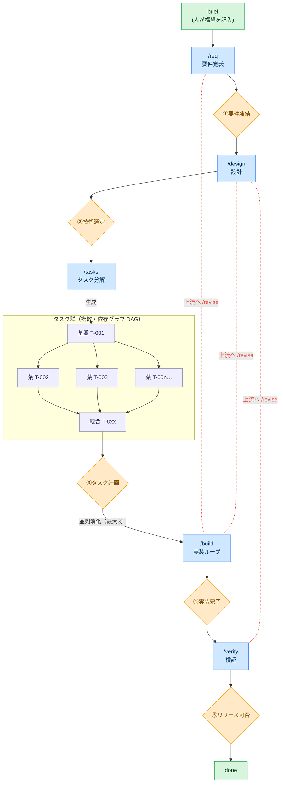

# AgentLoopTemplate

**Human on the Loop** で開発を進めるための Claude Code テンプレート。
コーディングエージェントが要件定義〜テストまでの作業・成果物作成・自己テストを担い、
**人間は各フェーズ境界の「ゲート」で承認・判断するだけ**でよい。

## コンセプト



凡例: 🟦 青=エージェントが実施するフェーズ ／ 🟧 橙=人が承認するゲート①〜⑤ ／ 🟩 緑=人の関与点（構想の記入・完了判断）／ 🟪 薄紫=タスク（**複数**・依存グラフ DAG。基盤→並列葉→統合）。**上から下へ前進**し（前提ゲート未承認なら次へ進めない）、`/tasks` がタスク群を生成→ゲート③承認→`/build` が並列消化（最大3）。赤い点線＝`/revise` による上流への差し戻し（build/verify から design/req へ。戻し先以降のゲートを連鎖して `pending` に戻す）。

各ゲートは人だけが開ける。承認の巻き戻し（`/revise`）も人の判断で行う。

## セットアップ

前提: WSL / Linux / macOS と `make`（Windows ネイティブ不可）。

1. **このテンプレートをコピー**して新しいプロダクトのリポジトリにする。
2. `git init` し、作業ブランチを作る（例: `git switch -c build/<product>`）。実装は main 直ではなく作業ブランチで行う。
3. ツール導入と依存同期:
   ```bash
   make install   # uv / pnpm のバイナリを導入
   make setup     # uv sync（dev 依存を同期、uv.lock を生成）
   # フロントを使う場合: cd frontend && pnpm install
   ```
4. 動作確認: `make check`（lint/format/type）・`make test`（pytest）・`make test-tools`（`scripts/agentloop/` の確定オーケストレータ自己テスト）。
5. プロジェクト名を記入: `pyproject.toml` の `name`（初期値 `project-name`）と `.agentloop/state.md` の `project`・`branch`。

## 使い方

1. `docs/00-product-brief.md` に「何を作りたいか」を数行書く（人が書く唯一の出発点）。
2. 以下を順に実行する。各コマンドの最後に人の承認を求めて止まる。

   | 手順 | コマンド | 何が起きるか | あなた（人）の役割 |
   |------|----------|--------------|--------------------|
   | 要件 | `/req`    | 壁打ちで要件を構造化 | ① 要件を凍結 |
   | 設計 | `/design` | 実装方針＋技術選定の選択肢提示 | ② 技術選定を決定・承認 |
   | 分解 | `/tasks`  | テスト方針付きタスク票を生成 | ③ タスク計画を承認 |
   | 実装 | `/build`  | loop で自律実装（test green 条件） | ④ 実装完了をレビュー承認 |
   | 検証 | `/verify` | 機能＋非機能テストを実行 | ⑤ リリース可否を判断 |

3. 実装中に上流（要件/設計）の不備が判明したら **`/revise <phase>`** で差し戻せる（戻し先以降のゲートを連鎖して `pending` に戻し、`dag.py --impacted` で影響タスクを reconcile）。承認の巻き戻しも人の判断で行う。
4. いつでも `/status` で現在フェーズ・ゲート承認状況・タスク進捗を確認できる。タスクの**全体像（依存図）**は `uv run python scripts/agentloop/dag.py --mermaid` で Mermaid を生成でき、GitHub/VS Code/Markdown にそのまま描画される（status 色分け・クリティカルパス強調）。

> **承認待ち中も止まらない**: ゲート到達時に通知が飛び、承認を待つ間もエージェントは
> 承認結果に依存しない作業（環境構築・調査・テストハーネス整備など）を先回りで進める。
> 承認結果を先取りする作業はしないため、ゲートの厳密さは保たれる。先回り分は暫定・破棄前提で
> `.agentloop/state.md` の「先回り作業ログ」に記録され、人が採否を判断できる。

### 実装フェーズを自律で回す

実装ループには2つのモードがある。挙動（DoD・並列/マージ規則）は同一。以下は要点で、運用の正典は `.claude/commands/build.md`（手順）と `CLAUDE.md`（規約）:

**A. 確定実行（推奨）— `make build-loop`**
スケジューリングをコードで確定駆動するオーケストレータ（`scripts/agentloop/build_loop.py`）。**どのタスクを・何並列で・どの順にマージし・いつ止めるか**を `.agentloop/config.yaml` と `tasks.yaml` から確定的に決め、LLM 裁量に依存しない。

```
make build-loop                  # 実行
make build-loop ARGS=--dry-run   # claude/git を呼ばず制御フローだけ確認
```

**B. 対話ループ — `/loop /build`**
オーケストレータを使わず会話でループを回す代替。

- 各タスクは **品質ゲートを全て通って**初めて完了扱い: 自動テスト green → `/simplify`（整理）→ `/code-review`（バグ修正）→ `make check`（lint/format/typecheck をエラーが消えるまで修正）。
- **並列タスクは隔離実行**: 独立した葉タスクは `git worktree` で各自のブランチ・作業ディレクトリに分離して **最大3並列**（`config.yaml` の `max_parallel`）で実装し、完了後に id 昇順で作業ブランチへ順次マージする。基盤タスクは作業ブランチ上で先に確定する。
- 解決不能なタスクは `blocked`、上流に不備があれば `needs-revision` として **人にエスカレーション**し、ループが止まる。
- **確定化の境界**: 制御フロー・並列・マージ・ゲート判定・停止はコードで確定。各タスクの実装コード内容のみ LLM 由来で非確定で、「ゲートを通るまで retry、駄目なら blocked」で吸収する。**`gates.build` はオーケストレータも触らない**（ゲートは人だけが開ける）。

> **前提スタック**: 同梱の `makefile` で `make test`（pytest）・`make check`（ruff/format/mypy/tsc を一括）を使う。`make check` は `make pre-commit`（commit ステージ）と `make pre-push`（format/mypy/tsc）を束ねたもの。`make` の無いプロジェクトにコピーした場合は、各自のテスト/チェックコマンドに読み替える。

### セキュリティ検査

3層で担保する: **gitleaks**（pre-commit でシークレットのコミットを機構的に防止。誤検知は `.gitleaksignore` で除外）／実装完了時に **`/security-review`** 必須／`/verify` で **`/security-review` + `make audit`**（依存の脆弱性監査）必須。

### GitHub Issues 連携（任意）

タスクをチーム/ステークホルダーに可視化したい場合、`tasks.yaml` を **GitHub Issues へ一方向ミラー**できる（`make issue-sync`）。

- **既定オフ**。`.agentloop/config.yaml` の `github.enabled: true` で有効化。`gh` CLI と GitHub remote が前提で、無ければ自動スキップ（オフライン・コピー直後でも壊れない）。
- 各タスク T-NNN ↔ Issue 1件。Issue 番号は tasks.yaml に書かず、ラベル＋タイトル接頭辞で突き合わせる。`done` は close。
- **付与ラベルで判別できる**: `kind:*`（種別）/ `status:*`（状態）/ `phase:*`（工程 requirements/design/build/verify）/ `req:*`（対応要件）。使用ラベルは `gh label create --force` で**自動作成（provisioning）**されるため、ラベル未作成の repo でも初回から失敗しない。
- **一方向のみ**: `tasks.yaml` が常に SSOT。Issues 側の編集は読み戻さない（確定駆動・オフライン性を保つ）。`make issue-sync ARGS=--dry-run` で予定だけ確認できる。
- Issue 書き込みは外向き操作のため、`github.enabled: true` の opt-in が同意を兼ねる。

## 構成

| パス | 役割 |
|------|------|
| `.agentloop/state.md` | フェーズ・ゲート・ログの SSOT |
| `.agentloop/tasks.yaml` | タスクグラフ(DAG)の機械可読 SSOT |
| `.agentloop/config.yaml` | 確定実行のノブ源（並列・retry・worktree・ゲート強制） |
| `scripts/agentloop/` | 確定オーケストレーション（`dag.py`／`build_loop.py`／`gate_guard.py`）。プロダクト用は `scripts/` 直下 |
| `CLAUDE.md` | エージェント運用規約・ゲート規則 |
| `.claude/commands/` | 各工程の入口（`/req` 〜 `/status`） |
| `.claude/agents/` | 専門サブエージェント（要件/設計/実装） |
| `docs/` | 工程成果物（要件・設計・ADR・タスク票・テスト計画） |

## 活用している Claude Code 機能

- **plan mode + ExitPlanMode** — 思考フェーズの承認ゲート
- **AskUserQuestion** — 技術選定など人の意思決定
- **/loop** — 実装タスクの自律消化（対話モード）
- **確定オーケストレータ（`make build-loop`）** — スケジューリング・並列・マージ・ゲート判定をコードで確定駆動
- **PreToolUse フック（`gate_guard.py`）** — 前提ゲート未承認時の成果物編集を機構的に deny
- **git worktree** — 並列タスクの隔離実行
- **subagent** — 工程ごとの専門化・コンテキスト分離
- **slash command** — 各工程の定型化
- **/schedule（任意）** — 長時間ループの定期進捗チェック
