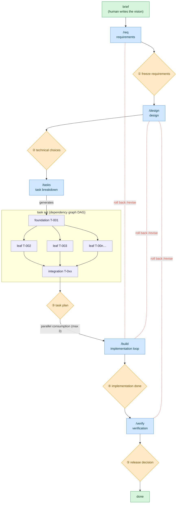

# AgentLoop

**English** | [日本語](README.ja.md)

A coding-agent harness for developing software **Human on the Loop**: the agent does the work,
produces the deliverables, and self-tests from requirements through testing — **humans only
approve/decide at the "gate" on each phase boundary**.

The harness is an **installed CLI** (`agentloop`); a product repository carries only its *state* —
`.agentloop/` (the SSOT + lock + materialized prompts/schema) and `docs/` (deliverables).

Works with **Claude Code** and **VS Code GitHub Copilot** (full support, incl. hook-enforced
gates — Copilot's hook mechanism is a VS Code preview feature), and with **Codex** and any other
agent that reads `AGENTS.md` (rules + procedures; gates by convention). See "Agent support".

## How it works



- 🟦 phases the agent runs
- 🟧 gates ①–⑤ — **only the human** opens them
- 🟩 points of human involvement
- 🟪 tasks — a DAG: foundation → parallel leaves → integration

The flow moves top to bottom and **cannot advance while the prerequisite gate is unapproved**;
`/build` consumes the task set in parallel (max 3). Red dotted lines = roll back upstream via
`/revise` (resets the gates from the target onward to `pending` in a chain) — also at the
human's discretion.

## Where to start

Install the CLI once (see "Setup"), then:

| Your situation | Entry point |
|---|---|
| New product from scratch (greenfield) | "Setup" → "Usage" |
| An ongoing repo (brownfield) | "Setup" — `agentloop init` auto-detects it — then `/onboard` |
| Already set up — next change | Write it into `docs/00-product-brief.md`, run `/req` (if the previous cycle is open, `agentloop cycle-close --name <slug>` first) |
| Release decided (gate ⑤) | `agentloop cycle-close --name <slug>` — archive this cycle's docs, reset for the next |
| Refresh the materialized tooling | `agentloop upgrade` (and `agentloop uninstall --all` to retract) |
| Lost or resuming | `/status` (tells you the next command), or `agentloop ui` for a local browser dashboard |

The daily human surface is a handful of verbs (everything else stays behind the dashboard's
buttons — `agentloop --help` lists them all):

```bash
agentloop start        # first run: interactive setup wizard; afterwards: where you are + what's next
agentloop next         # only the next recommended command (--json for integrations)
agentloop ui           # local dashboard — read the gate's deliverables and approve from the page
agentloop agent codex  # switch the headless agent CLI (claude | codex | gemini | a custom command)
agentloop project add  # register a repo the dashboard's project switcher can target
```

With several repos registered via `project add`, the dashboard grows a **project switcher** (a
dropdown in its header) that retargets the whole board without restarting the server; `agentloop ui`
always adds the repo you launched it from. For a single command, `agentloop --repo <path> <verb>`
(or `AGENTLOOP_ROOT=<path>`) targets another repo without changing directory.

## Design principles

AgentLoop is itself a multi-agent orchestration, built on three axes:

- **Architecture** — the simplest structure that works: `agentloop build` is a **deterministic DAG**
  scheduler; each phase is delegated to a dedicated role agent to separate concerns.
- **Context** — kept minimal: SSOT files hold the truth, role agents read only what they need,
  failures are **summarized not dumped**, logs rotate, and memory is tiered (session / cycle /
  permanent). See "Context budget" in `.agentloop/prompts/rules/gate-workflow.md`.
- **Tools** — minimal scoped role-agent grants; the quality gate has a retry cap.

## Setup

Prerequisites: WSL / Linux / macOS. Install the CLI so its hooks resolve on PATH:

```bash
uv tool install git+https://github.com/komoroko/AgentLoopTemplate   # provides `agentloop`
```

Mode A (`agentloop build`) additionally needs a **headless agent CLI** — `claude -p` by default;
switch with `agentloop agent codex` (rewrites `build.headless.cmd` in `.agentloop/config.yaml`;
`gemini` and custom commands work too). Without one, use interactive mode B (see "Agent support").

Seed a repository — the same command for a **greenfield** and a **brownfield** repo (brownfield is
auto-detected; see "Adopting into an existing repository"):

```bash
cd myrepo && git init            # any repo — new or existing

# interactive wizard (recommended; asks only the product name — defaulting to the folder — and a
# brief line. The branch defaults to build/<name>, the source URL is auto-detected from the
# install, and the headless CLI keeps its default — all overridable later, see below.)
agentloop start
# or non-interactively (idempotent):
#   agentloop init --name <product> [--branch build/<product>] [--source git+https://github.com/komoroko/AgentLoopTemplate]

# optional, per developer environment — add an agent's surfaces on demand:
agentloop install claude         # writes .claude/ wrappers + merges settings.json
agentloop install copilot        # writes .github/ prompt/agent/hook wrappers
```

Editor/agent integrations typically discover these command/prompt files only at session or
editor start, so open a **new** session (or restart the editor) after running `agentloop
install claude|copilot` — one already running won't pick up files added mid-session. In that
new session, start with **`/req`** (`agentloop next` always shows where you are and what to
run — see "Usage").

`agentloop init` writes **only state**:

- the SSOT trio (`state.md` / `config.yaml` / `tasks.yaml`, placeholder-filled) and the docs
  scaffolds;
- the materialized `.agentloop/prompts` + `.agentloop/schema` + `.agentloop/AGENTS.agentloop.md`,
  a pristine scaffold snapshot, and `.agentloop/agentloop.lock` (the tool version/source + a
  content hash per installed file);
- a marker-guarded pointer block appended to `AGENTS.md`;
- the work branch, created and switched to (implement there, not on main), with the gate guard
  flipped live.

Nothing else is touched: no build files, no makefile, no agent surfaces unless you
`agentloop install` them. A brownfield repo also gets the `/onboard` hint.

Keeping the materialized files current:

- `agentloop sync` — re-materializes the prompts/schema from the installed package (pristine files
  are refreshed; locally modified ones are kept and listed; `--force` overrides; `--check` reports
  drift without writing)
- `agentloop upgrade` — shows the changelog transition, then refreshes everything the tool
  materialized
- `uv tool upgrade agentloop` — upgrades the CLI *code* itself

## Adopting into an existing repository (brownfield)

There is no separate adopt command — `agentloop init` is the single entry point and **auto-detects**
an existing codebase (a `src/`, `package.json`, `pyproject.toml`, …). In that mode it:

- scopes `config.yaml`'s `guard_paths` to the docs deliverables only, so pending gates never freeze
  your existing code (re-enable code paths like `src/: tasks` when ready);
- fills the quality-gate test/check commands from your tooling when recognizable (override with
  `--test-cmd` / `--check-cmd`);
- annotates `docs/00-product-brief.md` with the adopted-note pointing at `/onboard`.

Existing files are **never overwritten** (idempotent re-runs). Then, inside the repo:

1. **`/onboard`** — surveys the codebase read-only and fills `docs/05-current-state.md` (the
   persistent baseline). Existing behavior is **not** reverse-generated into requirements or done
   tasks; traceability (R-N) covers each cycle's delta only. Half-done work is anchored by an
   **absorb task** that pins the existing partial code green before new work stacks on it.
2. **Delta cycles** — each `brief → /req → … → /verify` pass describes **one change**, closed with
   `agentloop cycle-close` (same steps as "Usage"). `docs/00-product-brief.md` and
   `docs/05-current-state.md` persist across cycles.
3. **Retract any time** — `agentloop uninstall claude|copilot` retracts an agent surface (pristine
   files only; the settings merge is reverted entry-by-entry), and `agentloop uninstall --all`
   removes every materialized artifact and the lock. Your repo state (SSOT, `docs/`) is never
   touched.

## Usage

1. Write a few lines on "what to build" in `docs/00-product-brief.md` (the only starting point a
   human writes).
2. Run these in order — each stops at the end to ask for approval:

   | Step | Command | What happens | Your role |
   |------|----------|--------------|-----------|
   | requirements | `/req`    | structure requirements by sounding out | ① freeze requirements |
   | design | `/design` | approach + technical-choice options | ② decide/approve technical choices |
   | breakdown | `/tasks`  | task tickets with a test approach | ③ approve the task plan |
   | implementation | `/build`  | autonomous loop (test-green condition) | ④ review/approve completion |
   | verification | `/verify` | run functional + non-functional tests | ⑤ decide on release |

3. **Open a gate** with the approval operation `agentloop approve <gate> [--by <name>]` — it stamps
   the date/approver on the gate line, advances the phase, and logs the `gate_approved` event.
   The agent may run it after your explicit "approve" but must never pre-authorize it (the
   permission prompt is your confirmation); editing a gate line by hand is denied by the guard.
4. **Roll back** on an upstream defect: `/revise <phase>` resets gates from the target onward and
   marks task impact (`agentloop revise --impacted T-00x` sets seeds and their transitive
   dependents to `needs-revision`).
5. **Check progress** anytime:
   - `agentloop next` — just the next recommended command (`--json` for integrations)
   - `/status` — the full picture in chat
   - `agentloop ui` — the dashboard: an Overview board; a **Review tab** where the gate under
     decision is read and approved in one pane (deliverables with their self-assessment pinned,
     gate ④'s diff and security-review freshness); a Tasks tab (DAG, layer progress); an Activity
     tab (live event feed, operations). The page can notify you when a gate or escalation starts
     waiting (opt-in bell; the tab title/favicon always show it). Actions stay a fixed whitelist —
     reads, fixed diagnostics (doctor, tests), and decision recording (approve / resolve / revise /
     cycle-close); phase execution and push/PR/merge are deliberately absent.
   - `agentloop dag --mermaid` — render the task dependency diagram
6. **Ship as a PR**: `agentloop pr-draft` assembles the PR body from the SSOT into
   `.agentloop/pr-draft.md` (read-only); creating/pushing the PR stays yours.
7. **Close the cycle** after gate ⑤: `agentloop cycle-close --name <slug>` archives to
   `docs/archive/<date>-<slug>/`, restores fresh scaffolds, and resets gates/phase. A human
   operation, like opening a gate.

> **No stalling during approval waits**: a notification fires on reaching a gate, and while
> waiting the agent pulls forward only **outcome-independent** work (environment setup,
> investigation, test-harness setup) — throwaway-by-default and logged in the "speculative work
> log" of `state.md`. It does nothing that pre-empts the approval outcome, so the gate's strictness
> is preserved.

### Running the implementation phase autonomously

Two modes with identical behavior (DoD, parallelism/merge). Canon: `.agentloop/prompts/commands/build.md` + `AGENTS.md`.

**A. Deterministic (recommended) — `agentloop build`.** The orchestrator decides which tasks, at
what parallelism, in what merge order, and when to stop — deterministically from `config.yaml` +
`tasks.yaml`, not by LLM discretion (`--dry-run` checks the control flow without calling the agent
CLI/git).

**B. Interactive** — the lead re-enacts mode A in conversation (the only mode without a headless
CLI): Claude Code drives it with `/loop /build`; Copilot re-invokes `/build` per iteration; Codex
re-runs the `/build` procedure.

Both share:

- A task is done only after **passing the quality-gate pipeline** — `quality_gate.steps` in
  `config.yaml` is the **single DoD definition** (default: `test` → `check` → a
  `/code-review`+`/simplify` review step → a real-launch smoke test for runnable deliverables).
  Each step has its own retry budget; exhausting it → `blocked`. Set the smoke step
  `required: true` once the deliverable is runnable, so a forgotten launch check refuses to build.
- **Parallel leaves run isolated** via `git worktree` (up to 3, `max_parallel`), merged into the
  work branch in ascending-id order. After a batch merges ≥2 leaves, the cmd steps re-run on the
  merged branch (integration gate). Before any merge, every path a task changed is re-checked
  against the gate rules — a violation escalates (`gate_violation`) and blocks instead of landing.
- An unsolvable task → `blocked`; an upstream defect → `needs-revision`, escalated, loop stops.
  The orchestrator **never touches `gates.build`** (only the human opens a gate).

> **DoD commands are the project's own**: `quality_gate.steps` names them once (the shipped
> defaults `make test` / `make check` are placeholders — `agentloop init` fills detected commands
> in a brownfield repo; substitute yours otherwise).

### Security review

Three layers:

- **gitleaks** at pre-commit (false positives → `.gitleaksignore`)
- a **security review**, mandatory at implementation completion — mode A auto-runs it headless and
  binds the report to the reviewed HEAD in `.agentloop/security-review.md`
- a **security review + a dependency audit** in `/verify`

An agent without `/security-review` does an equivalent pass, recorded the same way.

### GitHub Issues integration (optional)

**Off by default.** Enable with `github.enabled: true` (needs the `gh` CLI + a GitHub remote;
auto-skips if absent). `agentloop issue-sync` **one-way-mirrors** `tasks.yaml` to Issues — one issue
per T-NNN, matched by a hidden `<!-- agentloop:T-NNN -->` marker, labeled `kind:*` / `status:*` /
`phase:*` / `req:*` (auto-created). Edits on the Issues side are never read back (`tasks.yaml` stays
SSOT). Writing issues is outward-facing, so the opt-in is the consent.

## Troubleshooting

- **First, `agentloop doctor`** — a read-only diagnosis of the whole setup (PATH binaries,
  config/state/tasks consistency, gate-chain invariant, hook registration, worktree leftovers, open
  escalations, security-review↔HEAD binding, lock health, schema validation). Most situations below
  surface here.
- **A task went `blocked`** — the quality gate failed within its retry budget. Read the escalation
  (`agentloop events --render`), fix the cause (or the ticket), set `status` back to `todo` in
  `tasks.yaml`, close the event (`agentloop events --resolve <ID> --note "…"`), re-run `agentloop
  build`. If it's an upstream defect, `/revise <phase>` instead.
- **Loop interrupted** (Ctrl-C, crash) — just re-run `agentloop build`; it resets `in_progress`
  tasks to `todo` and cleans leftover worktrees on startup.
- **Edit denied by the gate guard** — you're editing a next-phase deliverable while its gate is
  `pending`; that's the mechanism working. Get the gate approved. Emergency hatch:
  `gates.enforce_hook: false`.
- **"template placeholders"** — run `agentloop start` (or `agentloop init --name <product>`) first.
- **`agentloop: command not found` in a hook** — install the CLI on PATH (`uv tool install
  git+<the agentloop repo>`); `agentloop doctor` FAILs when the hook binary is unresolvable.
- **`/req` (or other phase commands) don't show up in your agent** — the agent surface is
  opt-in and not run automatically by `agentloop start`/`init`: run `agentloop install
  claude` (writes `.claude/commands/` + merges `.claude/settings.json`) or `agentloop install
  copilot` (writes the `.github/` wrappers), matching whichever agent you use. These are
  typically discovered only at session/editor start, so also open a **new** session (or
  restart the editor) afterward — one already running won't pick up files added mid-session.

## Repository layout

| Path | Role |
|------|------|
| `.agentloop/state.md` | SSOT for phase, gates, logs |
| `.agentloop/tasks.yaml` | machine-readable SSOT of the task graph (DAG) |
| `.agentloop/events.ndjson` | orchestration events — the escalation log's machine truth (`agentloop events`; created on the first event) |
| `.agentloop/config.yaml` | deterministic-execution knobs + the single DoD (`quality_gate.steps`) |
| `.agentloop/agentloop.lock` | the tool version/source, schema versions, and a content hash per installed file |
| `.agentloop/schema/` | JSON Schemas for `config.yaml` / `tasks.yaml` (editor validation; `agentloop doctor`) — materialized |
| `.agentloop/prompts/` | the shared phase procedures, role definitions, and phase-scoped rules modules (`rules/`) every agent reads — materialized |
| `.agentloop/AGENTS.agentloop.md` | the operating-rules body, imported by the agent surfaces — materialized |
| `AGENTS.md` / `CLAUDE.md` | the agent-neutral operating rules / the Claude Code capability mapping (Claude Code reads CLAUDE.md, not AGENTS.md; its `@AGENTS.md` import loads the rules exactly once. `agentloop install claude` writes the mapping block and the `.claude/` wrappers into a product repo) |
| `.claude/`, `.github/` | per-agent entry points, role wrappers, and gate-guard hook registration (opt-in via `agentloop install`) |
| `docs/` | phase deliverables (requirements, design, ADR, task tickets, test plan) |

The orchestration code itself lives in the installed `agentloop` package, not in the repo.

## Agent support

The rules (`AGENTS.md`) and procedures (`.agentloop/prompts/`) name human-interaction points with a
**capability vocabulary**; each agent's mapping file says how to realize it.

| Capability | Claude Code | VS Code Copilot | Codex (& other AGENTS.md readers) |
|---|---|---|---|
| phase entry points | slash commands (`.claude/commands/`) | prompt files (`.github/prompts/`) | say the phase name → reads `.agentloop/prompts/commands/<name>.md` |
| gate enforcement | PreToolUse hook + commit-stage check | same hook via agent hooks (preview) + commit-stage check | commit-stage check only; edit-time by convention |
| structured questions | AskUserQuestion | numbered options in chat | numbered options in chat |
| approval presentation | plan mode + ExitPlanMode | Plan mode / explicit "approve" | explicit "approve" |
| role delegation | subagents, worktree-parallel | custom agents `@architect` … | inline role adoption (serial) |
| autonomous build | `/loop /build` (B) · `agentloop build` (A) | re-invoke `/build` (B) · `agentloop build` (A) | re-run `/build` (B) · `agentloop build` (A) |
| pending-gate notification | PushNotification | end of turn | end of turn |

- Agent surfaces are opt-in — `agentloop install claude|copilot` writes them, and they invoke the
  installed `agentloop` CLI (so `uv tool install` is a prerequisite of the hooks).
- Agent hooks in VS Code Copilot are a **preview** feature (re-verified 2026-07 against VS Code
  v1.110: still preview; the events and file format this repo uses are current) — if off, the
  gates still hold by convention.
- Parallel leaf tasks degrade to serial where delegation isn't available. `agentloop doctor`
  reports which hook hosts are registered.
- For maintainers: VS Code tool identifiers are not versioned by the template — if one is renamed
  upstream, fix the Copilot mapping's tool table and `.github/agents/*.agent.md` only (the shared
  role bodies never name tools).
