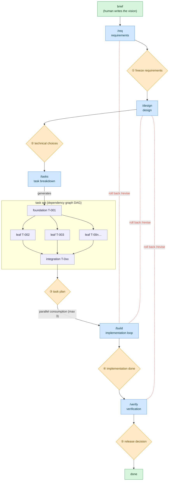

# AgentLoopTemplate

**English** | [日本語](README.ja.md)

A coding-agent template for developing software **Human on the Loop**: the agent does the work,
produces the deliverables, and self-tests from requirements through testing — **humans only
approve/decide at the "gate" on each phase boundary**.

Works with **Claude Code** and **VS Code GitHub Copilot** (full support, incl. hook-enforced
gates), and with **Codex** and any other agent that reads `AGENTS.md` (rules + procedures; gates
by convention). See "Agent support".

## Concept



🟦 phases the agent runs / 🟧 gates ①–⑤ **only the human** opens / 🟩 points of human
involvement / 🟪 tasks (a DAG: foundation → parallel leaves → integration). The flow moves top to
bottom and **cannot advance while the prerequisite gate is unapproved**; `/build` consumes the
task set in parallel (max 3). Red dotted lines = roll back upstream via `/revise` (resets the
gates from the target onward to `pending` in a chain) — also at the human's discretion.

## Where to start

| Your situation | Entry point |
|---|---|
| New product from scratch (greenfield) | "Setup" → "Usage" |
| Installing into an ongoing repo (brownfield) | "Adopting into an existing repository" → `/onboard` |
| Already set up — next change | Write it into `docs/00-product-brief.md`, run `/req` (if the previous cycle is open, `make cycle-close NAME=<slug>` first) |
| Release decided (gate ⑤) | `make cycle-close NAME=<slug>` — archive this cycle's docs, reset for the next |
| Refresh / retract the tooling | `make -f agentloop.mk agentloop-upgrade` / `agentloop-uninstall` |
| Lost or resuming | `/status` (tells you the next command), or `make ui` for a local browser dashboard |

The daily human surface is one entry point with four verbs (everything else stays behind the
dashboard's buttons or the operational `make` targets — `./agentloop --help` lists them):

```bash
./agentloop start        # first run: interactive setup wizard; afterwards: where you are + what's next
./agentloop next         # only the next recommended command (--json for integrations)
./agentloop ui           # local dashboard — approve gates, run doctor/revise/cycle-close from the page
./agentloop agent codex  # switch the headless agent CLI (claude | codex | gemini | a custom command)
```

## Design principles

This template is itself a multi-agent orchestration, built on three axes:

- **Architecture** — the simplest structure that works: `build_loop.py` is a **deterministic DAG**
  scheduler; each phase is delegated to a dedicated role agent to separate concerns.
- **Context** — kept minimal: SSOT files hold the truth, role agents read only what they need,
  failures are **summarized not dumped**, logs rotate, and memory is tiered (session / cycle /
  permanent). See "Context budget" in `AGENTS.md`.
- **Tools** — minimal scoped role-agent grants; the quality gate has a retry cap.

## Setup (greenfield)

Prerequisites: WSL / Linux / macOS and `make` (not Windows-native). Mode A (`make build-loop`)
additionally needs a **headless agent CLI** — `claude -p` by default; switch with
`./agentloop agent codex` (rewrites `build.headless.cmd` in `.agentloop/config.yaml`; `gemini`
and custom commands work too). Without one, use interactive mode B (see "Agent support").

```bash
# 1. copy the template
git clone --depth 1 https://github.com/you/AgentLoopTemplate.git myproduct
cd myproduct && rm -rf .git && git init

# 2. install tools and deps
make install   # uv / pnpm binaries (offline: install them manually)
make setup     # uv sync
# frontend only: scaffold into frontend/ (e.g. `pnpm create vite frontend`), then pnpm install

# 3. initialize the product — the interactive wizard (recommended; asks name / branch /
#    upgrade source / headless agent CLI / a first product-brief line)
./agentloop start
# or non-interactively (idempotent):
#   make init NAME=<product> FROM=https://github.com/you/AgentLoopTemplate.git
#   (optionally BRANCH=build/<product>)

# 4. sanity check
make check && make test && make test-tools
```

`make init` (the wizard runs the same sequence) fills the placeholders, creates and switches to
the work branch (implement there, not on main), flips `gates.template_mode` off so the gate guard
goes live, and records
`.agentloop/adopt-manifest.yaml` (provenance + per-file hashes) — the basis for upgrade/uninstall.
`FROM` is remembered as the default upgrade source. Your `AGENTS.md`, `CLAUDE.md`, and
`.claude/settings.json` are yours from day one — upgrades never rewrite them.

## Adopting into an existing repository (brownfield)

An ongoing repo isn't copied over — AgentLoop is **installed into it**, additively and
conflict-aware, from a checkout of this template (`uv` is the only prerequisite in the target):

```bash
make adopt TARGET=../myrepo NAME=myrepo TEST_CMD="npm test" CHECK_CMD="npm run lint"
# preview: append ARGS=--dry-run
```

Idempotent (re-runs skip what's present). Copied files are **never overwritten**; `AGENTS.md` /
`CLAUDE.md` / `.claude/settings.json` are **merged** (template rules land in
`.agentloop/AGENTS.agentloop.md` with one pointer/import block appended); `config.yaml`'s
`guard_paths` is scoped to docs deliverables only, so pending gates never freeze your existing
code (add code paths like `src/: tasks` when ready). Your `makefile` / `.pre-commit-config.yaml`
aren't touched — add `include agentloop.mk`.

Then, inside the adopted repo:

1. **`/onboard`** — surveys the codebase read-only and fills `docs/05-current-state.md` (the
   persistent baseline). Existing behavior is **not** reverse-generated into requirements or done
   tasks; traceability (R-N) covers each cycle's delta only. Half-done work is anchored by an
   **absorb task** that pins the existing partial code green before new work stacks on it.
2. **Delta cycles** — each `brief → /req → … → /verify` pass describes **one change** (same steps
   as "Usage"). After the release decision, `make cycle-close NAME=<slug>` archives the cycle's
   docs and resets gates/phase. `docs/00-product-brief.md` and `docs/05-current-state.md` persist.
3. **Upgrade / uninstall (any time)** — both are manifest- and hash-driven, so a file you edited
   since install is **never overwritten or removed** (skipped and listed; `FORCE=1` overrides).
   Upgrade never touches repo-owned state (`config.yaml`, `state.md`, `tasks.yaml`, filled docs);
   uninstall removes installed files only while still unedited. Preview with `ARGS=--dry-run`.
   ```bash
   make -f agentloop.mk agentloop-upgrade FROM=https://github.com/you/AgentLoopTemplate.git
   make -f agentloop.mk agentloop-uninstall
   ```

## Usage

1. Write a few lines on "what to build" in `docs/00-product-brief.md` (the only starting point a
   human writes).
2. Run these in order — each stops at the end to ask for approval:

   | Step | Command | What happens | Your role |
   |------|----------|--------------|-----------|
   | requirements | `/req`    | structure requirements by sounding out | ① freeze requirements |
   | design | `/design` | approach + technical-choice options | ② decide/approve technical choices |
   | breakdown | `/tasks`  | task tickets with a test approach | ③ approve the task plan |
   | implementation | `/build`  | autonomous loop (test-green condition) | ④ review/approve completion |
   | verification | `/verify` | run functional + non-functional tests | ⑤ decide on release |

3. **Open a gate** with the approval operation `make approve GATE=<gate> [BY=<name>]` — it stamps
   the date/approver on the gate line, advances the phase, and logs the `gate_approved` event.
   The agent may run it after your explicit "approve" but must never pre-authorize it (the
   permission prompt is your confirmation); editing a gate line by hand is denied by the guard.
4. **Roll back** on an upstream defect: `/revise <phase>` resets gates from the target onward and
   marks task impact (`make revise ARGS="--impacted T-00x"` sets seeds and their transitive
   dependents to `needs-revision`).
5. **Check progress** anytime: `./agentloop next` prints just the next recommended command
   (`--json` for integrations), `/status` gives the full picture in chat, and `make ui` (=
   `./agentloop ui`) shows the same board in a browser (read-only by default; a fixed whitelist of
   safe operations and gate-approval recording can run from the page). Render the task dependency
   diagram with
   `uv run --no-project --with pyyaml python scripts/agentloop/dag.py --mermaid`.
6. **Ship as a PR**: `make pr-draft` assembles the PR body from the SSOT into
   `.agentloop/pr-draft.md` (read-only); creating/pushing the PR stays yours.
7. **Close the cycle** after gate ⑤: `make cycle-close NAME=<slug>` archives to
   `docs/archive/<date>-<slug>/`, restores fresh scaffolds, and resets gates/phase. A human
   operation, like opening a gate.

> **No stalling during approval waits**: a notification fires on reaching a gate, and while
> waiting the agent pulls forward only **outcome-independent** work (environment setup,
> investigation, test-harness setup) — throwaway-by-default and logged in the "speculative work
> log" of `state.md`. It does nothing that pre-empts the approval outcome, so the gate's strictness
> is preserved.

### Running the implementation phase autonomously

Two modes with identical behavior (DoD, parallelism/merge). Canon: `.agentloop/prompts/commands/build.md` + `AGENTS.md`.

**A. Deterministic (recommended) — `make build-loop`.** An orchestrator
(`scripts/agentloop/build_loop.py`) decides which tasks, at what parallelism, in what merge order,
and when to stop — deterministically from `config.yaml` + `tasks.yaml`, not by LLM discretion
(`ARGS=--dry-run` checks the control flow without calling the agent CLI/git).

**B. Interactive** — the lead re-enacts mode A in conversation (the only mode without a headless
CLI): Claude Code drives it with `/loop /build`; Copilot re-invokes `/build` per iteration; Codex
re-runs the `/build` procedure.

Both share:

- A task is done only after **passing the quality-gate pipeline** — `quality_gate.steps` in
  `config.yaml` is the **single DoD definition** (default: `make test` → `make check` → a
  `/code-review`+`/simplify` review step → a real-launch smoke test for runnable deliverables).
  Each step has its own retry budget; exhausting it → `blocked`. Set the smoke step
  `required: true` once the deliverable is runnable, so a forgotten launch check refuses to build.
- **Parallel leaves run isolated** via `git worktree` (up to 3, `max_parallel`), merged into the
  work branch in ascending-id order. After a batch merges ≥2 leaves, the cmd steps re-run on the
  merged branch (integration gate). Before any merge, every path a task changed is re-checked
  against the gate rules — a violation escalates (`gate_violation`) and blocks instead of landing.
- An unsolvable task → `blocked`; an upstream defect → `needs-revision`, escalated, loop stops.
  The orchestrator **never touches `gates.build`** (only the human opens a gate).

> **Assumed stack**: the bundled `makefile` provides `make test` (pytest) and `make check`
> (ruff/format/mypy/tsc). In a project without `make`, substitute your own commands in
> `quality_gate.steps`.

### Security review

Three layers: **gitleaks** at pre-commit (false positives → `.gitleaksignore`) / a **security
review** mandatory at implementation completion — mode A auto-runs it headless and binds the report
to the reviewed HEAD in `.agentloop/security-review.md` / a **security review + `make audit`** in
`/verify`. An agent without `/security-review` does an equivalent pass, recorded the same way.

### GitHub Issues integration (optional)

**Off by default.** Enable with `github.enabled: true` (needs the `gh` CLI + a GitHub remote;
auto-skips if absent). `make issue-sync` **one-way-mirrors** `tasks.yaml` to Issues — one issue per
T-NNN, matched by a hidden `<!-- agentloop:T-NNN -->` marker, labeled `kind:*` / `status:*` /
`phase:*` / `req:*` (auto-created). Edits on the Issues side are never read back (`tasks.yaml` stays
SSOT). Writing issues is outward-facing, so the opt-in is the consent.

## Troubleshooting

- **First, `make doctor`** — a read-only diagnosis of the whole setup (PATH binaries,
  config/state/tasks consistency, gate-chain invariant, hook registration, worktree leftovers, open
  escalations, security-review↔HEAD binding, schema validation). Most situations below surface here.
- **A task went `blocked`** — the quality gate failed within its retry budget. Read the escalation
  (`make events ARGS=--render`), fix the cause (or the ticket), set `status` back to `todo` in
  `tasks.yaml`, close the event (`make events ARGS='--resolve <ID> --note "…"'`), re-run
  `make build-loop`. If it's an upstream defect, `/revise <phase>` instead.
- **Loop interrupted** (Ctrl-C, crash) — just re-run `make build-loop`; it resets `in_progress`
  tasks to `todo` and cleans leftover worktrees on startup.
- **Edit denied by the gate guard** — you're editing a next-phase deliverable while its gate is
  `pending`; that's the mechanism working. Get the gate approved. Emergency hatch:
  `gates.enforce_hook: false`.
- **"template placeholders"** — run `./agentloop start` (or `make init NAME=<product>`) first.
- **No usable `make` in an adopted repo** — the targets are self-contained in `agentloop.mk` (uv
  only): `make -f agentloop.mk build-loop`.

## Layout

| Path | Role |
|------|------|
| `.agentloop/state.md` | SSOT for phase, gates, logs |
| `.agentloop/tasks.yaml` | machine-readable SSOT of the task graph (DAG) |
| `.agentloop/events.ndjson` | orchestration events — the escalation log's machine truth (`make events`; created on the first event) |
| `.agentloop/config.yaml` | deterministic-execution knobs + the single DoD (`quality_gate.steps`) |
| `.agentloop/schema/` | JSON Schemas for `config.yaml` / `tasks.yaml` (editor validation; `make doctor`) |
| `.agentloop/prompts/` | the shared phase procedures and role definitions every agent reads |
| `scripts/agentloop/` | deterministic orchestration (`dag.py`, `build_loop.py`, `gate_guard.py`, `revise.py`, `adopt.py`, …) + the dashboard (`status_api.py`, `ui.py`). Product scripts go under `scripts/` |
| `VERSION` / `CHANGELOG.md` | the template's release identity |
| `agentloop` | the daily human entry point — `./agentloop start / next / ui / agent` (uv only) |
| `agentloop.mk` | the AgentLoop make targets, self-contained (uv only) |
| `AGENTS.md` / `CLAUDE.md` | the agent-neutral operating rules / the Claude Code capability mapping |
| `.claude/`, `.github/` | per-agent entry points, role wrappers, and gate-guard hook registration |
| `docs/` | phase deliverables (requirements, design, ADR, task tickets, test plan) |

## Agent support

The rules (`AGENTS.md`) and procedures (`.agentloop/prompts/`) name human-interaction points with a
**capability vocabulary**; each agent's mapping file says how to realize it.

| Capability | Claude Code | VS Code Copilot | Codex (& other AGENTS.md readers) |
|---|---|---|---|
| phase entry points | slash commands (`.claude/commands/`) | prompt files (`.github/prompts/`) | say the phase name → reads `.agentloop/prompts/commands/<name>.md` |
| gate enforcement | PreToolUse hook + commit-stage check | same hook via agent hooks (preview) + commit-stage check | commit-stage check only; edit-time by convention |
| structured questions | AskUserQuestion | numbered options in chat | numbered options in chat |
| approval presentation | plan mode + ExitPlanMode | Plan mode / explicit "approve" | explicit "approve" |
| role delegation | subagents, worktree-parallel | custom agents `@architect` … | inline role adoption (serial) |
| autonomous build | `/loop /build` (B) · `make build-loop` (A) | re-invoke `/build` (B) · `make build-loop` (A) | re-run `/build` (B) · `make build-loop` (A) |
| pending-gate notification | PushNotification | end of turn | end of turn |

Agent hooks in VS Code Copilot are a **preview** feature — if off, the gates still hold by
convention. Parallel leaf tasks degrade to serial where delegation isn't available. `make doctor`
reports which hook hosts are registered.
